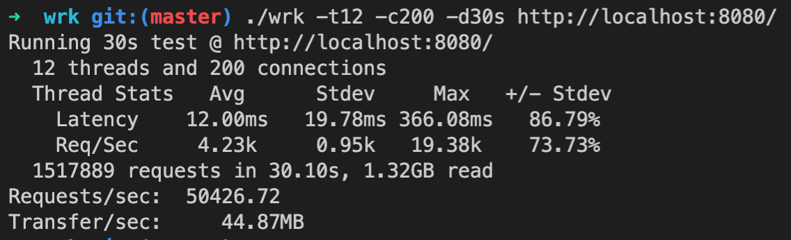

# wbL0

* [Start](#Start the NATS Streaming Server)
* [Stress test](#Stress_test)
* [fd](#Strest_wef)

configuration - [viper](https://github.com/spf13/viper)

client id must be different

-help to view all flags

run:
* stan: cd nats-streaming-server; go run nats-streaming-server.go
* subscriber: go run main.go -ch=qoo
* publisher: go run publisher/publisher.go -ch=qoo -msg=hi

### Start the NATS Streaming Server
https://docs.nats.io/legacy/stan/changes/run

1. Clone the following repositories:
* NATS Streaming Server: 
```
git clone https://github.com/nats-io/nats-streaming-server.git
```
* NATS Streaming Client:
```
git clone https://github.com/nats-io/stan.go.git
```

2. Run from source:
```
go run nats-streaming-server.go
```

f
f
f
f
f
f


### Stress test
<a name="Stress_test"></a>
[WRK](https://github.com/wg/wrk) it's a tool for stress test




### Strest wef
fedsqefd
