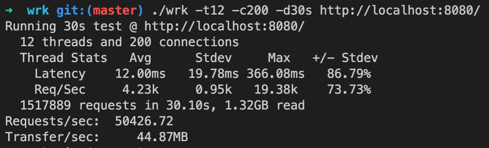

# wbL0

### Содержание
* [Запуск](#run)
* [Флаги](#flags)
* [Конфигурация](#configuration)
* [База данных](#)
* [Запуск NATS Streaming Server](#start_stan)
* [Стресс тест](#Stress_test)

### Запуск
<a name="run"></a>

* [Запустить](#start_stan) stan (NATS Streaming Server)
* Скомпилировать ./server и ./publisher:
```
make
```
* Запустить сервер:
```
./server
```
* Запустить publisher передать файл с даннми для отправки:
```
./publisher -data=testData/model1.json
```
Для проверки: запустить скрипт, который отправляет валидные json и файлы с ошибками:
```
sh test.sh
```

### Флаги
<a name="flags"></a>
Чтобы посмотреть все флаги и их значения, нужно передать флаг -help (./server -help)

Заметки по флагам:
* Для успешной публикации данных на сервере флаг -ch должен быть одинаковым у ./server и ./publisher
* Флаг -id у ./server и ./publisher должен быть разный

### Конфигурация
<a name="configuration"></a>

Стандартный файл - configs/config.go

Конфиг. файл должен содержать:
* bind_addr - порт для старта сервера
* name - название базы данных
* username, password, host - инфоормация о базе данных
* table - таблица в бд с данными

Конфиг парсится с помощью [viper](https://github.com/spf13/viper)

### База данных
БД - postgreSQL

Информация для создания таблицы в _info/init.sql


### Запуск NATS Streaming Server (stan)
<a name="start_stan"></a>
[NATS Streaming documentation](https://docs.nats.io/legacy/stan/changes/run)

```
git clone https://github.com/nats-io/nats-streaming-server.git
cd nats-streaming-server
go run nats-streaming-server.go
```

### Стресс тест
<a name="Stress_test"></a>

[WRK](https://github.com/wg/wrk) - утилита для стресс тестов.

200 подключений за 30 секунд к localhost:8080:


[Статья](https://russianblogs.com/article/91881608365/), в которой описано, что значит вывод.
